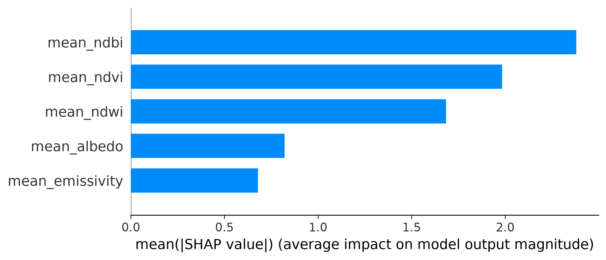
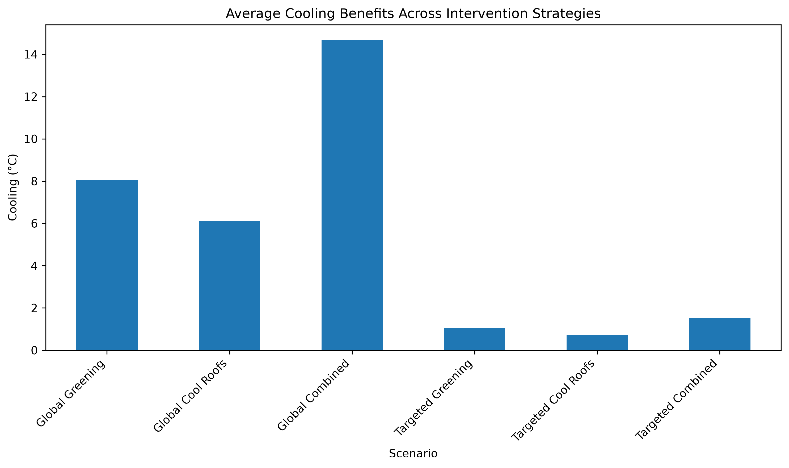

# Urban Heat Intelligence Platform


> An explainable geospatial AI platform for understanding, predicting, and mitigating urban heat using satellite-derived environmental indicators and machine learning.

---

## Dashboard Preview


---

## Problem Statement

Rapid urbanization has intensified the **Urban Heat Island (UHI)** effect, increasing energy demand, reducing thermal comfort, and exacerbating heat-related health risks during extreme heat events.

While cities often know **where** heat occurs, understanding **why** it occurs and **which mitigation strategies are most effective** remains challenging.

The **Urban Heat Intelligence Platform** addresses this gap by integrating **remote sensing**, **physics-aware machine learning**, **explainable AI**, and **scenario-based intervention analysis** into an interactive decision-support system for urban heat mitigation.

Using **Delhi, India** as a case study, the platform predicts **Land Surface Temperature (LST)** patterns, identifies the environmental drivers of urban heat, and evaluates mitigation strategies such as urban greening and cool roofs.

---

## Key Features

- Land Surface Temperature modelling using Landsat 8 imagery
- Physics-aware environmental feature engineering
- Explainable AI using SHAP
- Scenario-based intervention simulations
- Interactive Streamlit dashboard for decision support

---

## Final Model Performance

| Metric   | Value        |
| -------- | ------------ |
| **R²**   | **0.710**    |
| **RMSE** | **2.591 °C** |
| **MAE**  | **1.656 °C** |

The final deployed model was a **physics-aware XGBoost regressor** trained using satellite-derived environmental indicators.

---

## Methodological Workflow

```text
Landsat 8 Imagery
        ↓
Land Surface Temperature Derivation
        ↓
Environmental Feature Engineering
        ↓
Machine Learning Modelling
        ↓
SHAP Explainability
        ↓
Intervention Simulation
        ↓
Decision Support Dashboard
```

---

## Environmental Indicators

The following predictors were derived and incorporated into the modelling framework:

| Variable   | Description                  |
| ---------- | ---------------------------- |
| NDVI       | Vegetation availability      |
| NDBI       | Built-up intensity           |
| NDWI       | Surface moisture conditions  |
| Albedo     | Surface reflectivity         |
| Emissivity | Thermal radiation properties |

---

## Explainable AI

SHAP (SHapley Additive exPlanations) was used to investigate:

- Global feature importance
- Local prediction explanations
- Nonlinear relationships between predictors and temperature
- Threshold effects in environmental variables

### SHAP Summary Plot



### Key Insights

- Built-up intensity emerged as the strongest contributor to urban heating.
- Vegetation demonstrated substantial cooling effects.
- Surface moisture contributed to temperature reductions.
- Surface reflectivity played an important role in mitigating heat accumulation.

---

## Intervention Simulator

The final model was used to estimate cooling benefits associated with various urban heat mitigation strategies.

### Global Interventions

- Urban Greening
- Cool Roof Programs
- Combined Strategies

### Targeted Interventions

Interventions applied only to the hottest **10%** of urban locations:

- Targeted Greening
- Targeted Cool Roofs
- Targeted Combined Strategies

---

## Intervention Results

| Scenario            | Average Cooling (°C) | Maximum Cooling (°C) |
| ------------------- | -------------------- | -------------------- |
| Global Greening     | 8.06                 | 20.89                |
| Global Cool Roofs   | 6.11                 | 18.70                |
| Global Combined     | 14.67                | 29.22                |
| Targeted Greening   | 1.04                 | 16.53                |
| Targeted Cool Roofs | 0.72                 | 13.98                |
| Targeted Combined   | 1.53                 | 22.19                |

### Cooling Comparison



### Planning Insights

- Global interventions produced the largest city-wide cooling benefits.
- Targeted hotspot interventions achieved meaningful localized cooling while affecting a substantially smaller portion of the urban landscape.
- Strategic prioritization of hotspots may offer a practical compromise between effectiveness and implementation feasibility.

---

## Dashboard

The Urban Heat Intelligence Platform includes an interactive Streamlit dashboard providing:

- Project overview
- Model performance summaries
- SHAP-based explainability outputs
- Intervention simulation results
- Methodological documentation

### Dashboard Demo


To launch the dashboard:

```bash
streamlit run app/dashboard.py
```

---

## Project Structure

```text
urban_heat_decision_intelligence/
├── app/
│   └── dashboard.py
│
├── data/
│   ├── external/
│   ├── processed/
│   └── raw/
│
├── docs/
│   ├── intervention_comparison.png
│   ├── intervention_results.csv
│   ├── methodology.md
│   ├── shap_summary.png
│   └── screenshots/
│
├── notebooks/
│   ├── 01_eda.ipynb
│   ├── 02_random_forest_baseline.ipynb
│   ├── 03_xgboost.ipynb
│   ├── 04_prepare_dataset_v16.ipynb
│   ├── 05_random_forest_v16.ipynb
│   ├── 06_xgboost_v16.ipynb
│   ├── 07_monotonic_xgboost.ipynb
│   ├── 08_shap_analysis.ipynb
│   └── 09_intervention_simulator.ipynb
│
├── src/
├── tests/
├── README.md
└── requirements.txt
```

---

## Installation

Clone the repository:

```bash
git clone https://github.com/beastb728/urban-heat-decision-intelligence.git
cd urban-heat-decision-intelligence
```

Create and activate a virtual environment:

```bash
python -m venv urban_heat

# Linux / macOS
source urban_heat/bin/activate

# Windows
urban_heat\Scripts\activate
```

Install dependencies:

```bash
pip install -r requirements.txt
```

Run the dashboard:

```bash
streamlit run app/dashboard.py
```

---

## Technologies Used

- Python
- Google Earth Engine
- Landsat 8
- Pandas
- NumPy
- Matplotlib
- Scikit-learn
- XGBoost
- SHAP
- Streamlit

---

## Key Contributions

- Developed an end-to-end remote sensing pipeline for deriving urban thermal indicators.
- Constructed a city-scale urban heat dataset using a 250 m planning grid.
- Improved predictive performance through physics-aware feature engineering.
- Integrated explainable AI to uncover the drivers of urban heat.
- Built an intervention simulator for evaluating mitigation strategies.
- Deployed the workflow as an interactive decision-support dashboard.

---

## Future Work

Potential extensions include:

- Integration of meteorological variables
- Spatial cross-validation frameworks
- Interactive hotspot mapping
- User-defined intervention scenarios
- Multi-city comparative analyses
- Physics-Informed Neural Networks (PINNs)

---

## Author

**Ishaan**  
Undergraduate Engineering Student

---

## License

This project is released for educational and research purposes.